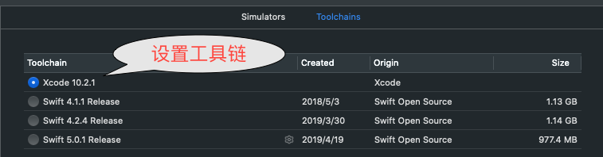

[下载最新模版](https://developer.apple.com/download/more/?=Swift%20Playgrounds%20Author%20Template)
 
`feed.json` 对应`docs`下的目录结构
### 找出目录名:
在`documents`数组中的字典对象的`contentIdentifier`的前缀就是`feedIdentifier`的值.  
docs目录下的目录名:`contentIdentifier`去除`feedIdentifier`前缀后的字符串.

### Introto目录
`thumbnail.png` 缩略图    
`bannerImage.png` 横幅图.  
`previewImage.png` 预览图.  
`IntrotoCI.playgroundbook.zip`   playgroundbook压缩包,用户将会下载的原始文件

### 官方教程
WWDC18 中的 创建您自己的 Swift Playgrounds 订阅内容.  
[订阅案例](https://wwdcphotofilters.github.io)


[简书:WWDC2018: 创建属于你自己的 Swift](https://www.jianshu.com/p/7f00c5d18ffc)

### 联调要求
模版对Xcode的版本有要求:
例如:`Swift_Playgrounds_Author_Template_for_Xcode_10.2.xip`
必须在Xcode10.2自带的`swift5.0`版本下才可以联调.


当在xcode11 自带`swift5.0.1`版本,联调`Swift_Playgrounds_Author_Template_for_Xcode_10.2.xip`:会提示
```
dyld: Symbol not found: _OBJC_CLASS_$__TtCs12_SwiftObject
Referenced from: /Users/admin/Library/Developer/CoreSimulator/Devices/5B052465-0628-4119-830D-F62E6FF2490A/data/Containers/Bundle/Application/1BD3094C-9020-42C4-9D0C-8BD4EDCCD98D/LiveViewTestApp.app/Frameworks/PlaygroundSupport.framework/PlaygroundSupport
Expected in: /Library/Developer/Toolchains/swift-5.0.1-RELEASE.xctoolchain/usr/lib/swift/iphonesimulator/libswiftCore.dylib
in /Users/admin/Library/Developer/CoreSimulator/Devices/5B052465-0628-4119-830D-F62E6FF2490A/data/Containers/Bundle/Application/1BD3094C-9020-42C4-9D0C-8BD4EDCCD98D/LiveViewTestApp.app/Frameworks/PlaygroundSupport.framework/PlaygroundSupport
```

升级或解决方案：
下载最新：`Swift_Playgrounds_Author_Template_for_Xcode_11.1.xip`，解压之后把`Template`目录下的`SupportingContent`替换该项目中对应的目录即可。
